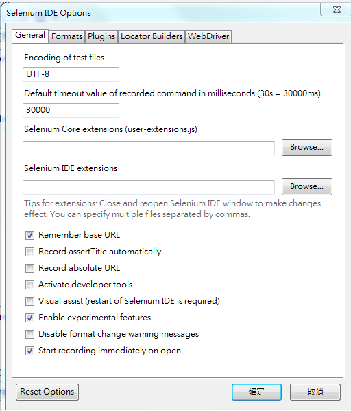

# Selenium-Usage

## 簡介
Selenium 是一套仿使用者操作網頁的測試工具，用來取代傳統使用人力進行手動測試網頁功能，把UI測試全自動化，把頁面操作流程以及預期它會出現的結果編寫成測試程式碼以減少花費在測試人力的成本。

## Selenium IDE
目前 Selenium IDE 只能使用Firefox瀏覽器上的外掛程式來操作，但是可以將操作結果匯出成各種語言諸如 PHP, python 等等，就可以使用其他瀏覽器甚至不用browser進行自動化測試。 Selenium IDE 安裝與使用方式如下:

### Install Selenium IDE
使用Firefox進入[Selenium download page](http://www.seleniumhq.org/download/)下載並安裝最新的Selenium IDE(目前最新版為[2.9.0](http://release.seleniumhq.org/selenium-ide/2.9.0/selenium-ide-2.9.0.xpi))，安裝完成後可由瀏覽器上方的 "工具 &gt; Selenium IDE" 開啟操作介面:


### 錄製test case
打開Selenium IDE，開始錄製，然後手動點要測試的網頁或是嘗試輸入值，結束後終止錄製，介面上會顯示出剛才操作的過程與結果，如圖:


### 輸出成script
"Options &gt; Format" 中有各種語言可以選擇，如果Format中顯示 "Want the formats back? Click to read more"，點選 "Options &gt; Options" 勾選 "Enable experimental features" 後即會顯示Formats。





可將檔案匯出成PHP(PHPUunit)格式，複製script另存成.php檔即可:


## Selenium RC
使用 Selenium RC server 執行test case可以不需經由Firefox IDE，首先須下載 Selenium RC:

### Install Selenium RC
 - 首先，Selenium RC 是由JAVA寫成，請確保你的電腦有安裝JAVA
 - 下載 [Selenium RC (2.45.0)](http://selenium-release.storage.googleapis.com/2.45/selenium-server-standalone-2.45.0.jar)
 - 打開terminal，啟動service:

 ```
 C:\ ~&gt; java -jar selenium-server-standalone-2.45.0.jar
 ```
 